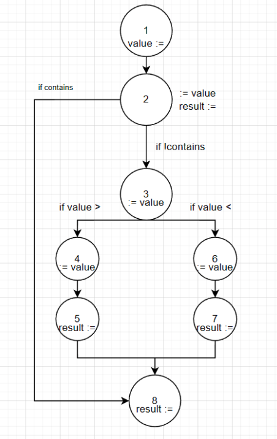
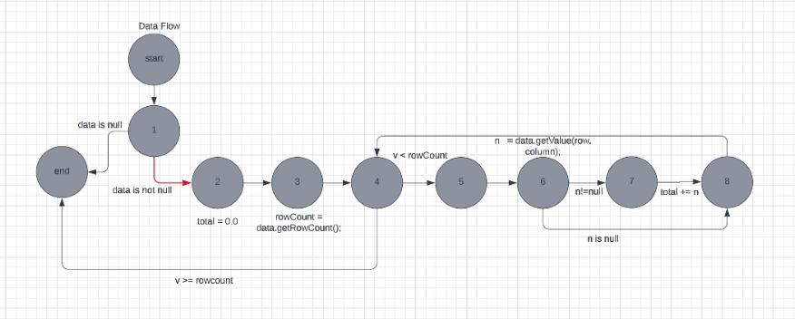
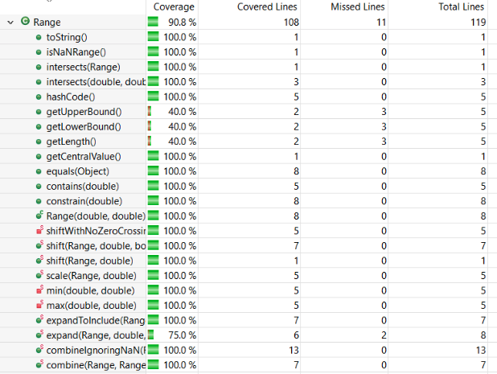
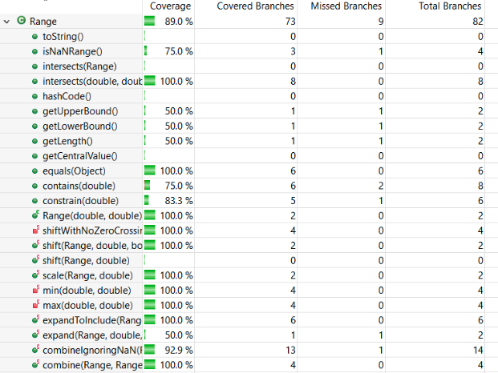
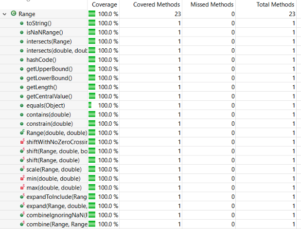
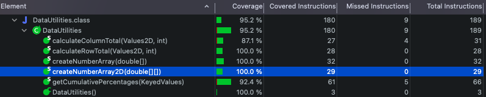

**SENG 438 - Software Testing, Reliability, and Quality**

**Lab. Report #3 – Code Coverage, Adequacy Criteria and Test Case Correlation**

| Group \#:      | 11    |
| -------------- | --- |
| Student Names: | Carter Boucher    |
|                | Ayo Olabode    |
|                | Maheen Hossain   |
|                | Jason Wu    |

# 1 Introduction

The primary aim of this laboratory is to familiarize individuals with the principles of white box testing through the utilization of the JUnit framework and coverage tools, which aid in generating a comprehensive code coverage for our test suite. Furthermore, applying white box testing ensures that our unit tests are validated at the unit testing level. The coverage tools utilized in this lab also assist in identifying the extent to which our unit testing has been executed through our created tests, as well as how much remains. White box testing permits us to conduct a more rigorous and comprehensive testing phase of the software development cycle by assessing all feasible code pathways.

Note: Java files in JFreeChart_Lab3/src/org/jfree/data/test

# 2 Manual data-flow coverage calculations for X and Y methods

## RangeTest.java

DU-Path Sets for Value du(1, value) = {[1,2,3,4], [1,2,3,6],[1,2]}
DU-Path Sets for Result du(2, result) = {[2,5,8], [2,7,8], [2,8]}

DU Pairs for Value {(1,2), (1,3), (1,4), (1,6)}
DU Pairs for Result {(2,8), (5,8), (7,8)}

    @Test Pair {(1,2), (1,3), (1,6), (1,7), (7,8))}
    public void testconstrainOutsideLower() {
        Range range1 = new Range(11, 15);
        double testResult = range1.constrain(10);
        assertTrue(testResult == 11);
    }
    
    @Test Pair {(1,2), (2,8))}
    public void testconstrainLower() {
        Range range1 = new Range(11, 15);
        double testResult = range1.constrain(11);
        assertTrue(testResult > 10);
    }
    
    @Test Pair {(1,2), (2,8))}
    public void testconstrainUpper() {
        Range range1 = new Range(11, 15);
        double testResult = range1.constrain(15);
        assertTrue(testResult == 15);
    }

    @Test Pair {(1,2), (2,8))}
    public void testconstrainTrueValue() {
        Range range1 = new Range(11, 15);
        double testResult = range1.constrain(13);
        assertTrue(testResult==13);
    }

    @Test Pair {(1,2), (1,3), (1,4), (1,5), (5,8))}
    public void testconstrainOutsideUpper() {
        Range range1 = new Range(11, 15);
        double testResult = range1.constrain(17);
        assertTrue(testResult==15);
    }

DU pair coverage is 100% because we have covered all pairs in our tests for both variables, Value, and Result.

## DataUtilitiesTest.java

Manual data-flow coverage calculations for X and Y methods
- du(1, data) = {[1], [1,2,3,4], [1,2,3,4, end], [1,2,3,4,5,6], [1,2,3,4,5,6,8],[1,2,3,4,5,6,7,8]}
- du(2, total) = {[2,3,4,end], [2,3,4,6,7,8,4,end], [2,3,4,5,6,8,4,end]}
- du(3, rowCount) = {[3,4,end], [3,4,5,6,7,8,4, end], [3,4,5,6,8,4]}
- du(4, v) = {[4, end], [4,5,6,8,4,end], [4,5,6,8,4],[4,5,6,7,8,4],[4,5,6,7,8,4, end]}
- du(6, n) = {[6,8], [6,7,8]}

Def-pair set:
- du(1, 1, data) = {[1]}
- du(2, 8, total) = {[2,3,4,5,6,7,8]}
- du(2, 4, total) = {[2,3,4]}
- du(3, 4, rowCount) = {[3,4], [3,4,5,6,7,8,4], [3,4,5,6,8,4]}
- du(4, 4, v) = {[4], [4,5,6,7,8,4], [4,5,6,8,4]}
- du(4, 8, v) = {[4,5,6,7,8], [4,5,6,8]}
- du(6, 8, n) = {[6,8], [6,7,8]}

|Method | Pair Covered |
| --- | --- |
|CalculateColumnWithNull() | {1} |
|CalculateColumnRandomValues() | {1,8}|
|CalculateColumnWithNegitiveInteger() | {4,8}|
|CalculateEmptyColumn() | {6,8}|

# 3 A detailed description of the testing strategy for the new unit test

For our new unit tests, we designed test cases using white-box testing because we have access to the class directly. We are able to see the code and design unit tests based off of the code structure directly. Our testing strategy was to design test cases to increase instruction coverage, branch coverage, and method coverage. We designed test cases based on knowledge of the code structure using coverage-tools and each test case was designed to increase coverage of at-least one category. We started with method-coverage to make sure that each method was covered and then instruction-coverage to make sure as many lines of code were utilized and tested as possible. To finish off our testing strategy, we went back through the methods and covered each possible branch found to increase branch-coverage.

__Coverage Before__

Range.java (Maheen and Jason)
- Instructions: 44.4%
- Branch: 52.6%
- Method: 52.9%

DataUtilities.java (Carter and Ayo)
- Instructions: 80.2%
- Branch: 73.5%
- Method: 100%

# 4 A high level description of five selected test cases you have designed using coverage information, and how they have increased code coverage

## __RangeTest.java__

@Test

    public void testCombineRangeNull() {
        Range range1 = null;
        Range range2 = null;
        Range testResult = Range.combine(range1, range2);
        assertNull(testResult);
    }

This test case was designed to increase branch-coverage because we could see that combine in Range had a branch to check for null ranges.

    @Test
    public void testCentralValue() {
        Range range1 = new Range(4, 10);
        double testResult = range1.getCentralValue();
        assertTrue(testResult == 7);
    }

This test case was designed to increase method-coverage to make sure that the output is as expected and that we tested each method in the class.

    @Test
    public void testIntersectEqual() {
        Range range1 = new Range(21, 25);
        Range range2 = new Range(21, 21);
        boolean testResult = range1.intersects(range2);
        assertFalse(testResult);
    }

This test case for function Intersect was designed using branch and method coverage information and helped increase coverage for those areas. The functions intersect are overloaded with one taking in two doubles as arguments and another taking in another range object. This test case tests the intersect method that takes in a double as an argument and also tests a branch of the intersect method that has the logic. Since (b0 < this.upper && b1 >= b0) is the condition, this test case tests the branch where b0 < upper and b1 > b0.

    @Test(expected = IllegalArgumentException.class)
        public void testRangeInvalid() {
        Range range1 = new Range(35, 32);
    }

This test case is designed to increase branch-coverage because with the ability to see the constructor of a Range object, we see that an IllegalArgumentException is thrown if a range is attempted to be 
constructed with a lower bound higher than upper bound. This test case also increases statement-coverage by making sure we are testing all lines within the constructor.

    @Test
        public void testCombineIgnoringRange2NaNandRange1NaN() {
        Range range1 = new Range(Double.NaN, Double.NaN);
        Range range2 = new Range(Double.NaN, Double.NaN);
        Range testResult = Range.combineIgnoringNaN(range1, range2);
        assertNull(testResult);
    }

This test case is designed to increase all method-coverage, branch-coverage, and statement coverage because it tests a branch of the combineIgnoringNaN function with both ranges having NaN values for lower and upper bounds. The combineIgnoringNaN function calls the min and max functions and therefore increase method-coverage and also statement-coverage making sure more of the code is covered and tested.

## __DataUtilitiesTest.java__

### __createNumberArrayOneElement()__

changed to createNumberArrayOneElementPos() and createNumberArrayOneElementNeg()
- Instruction: 13.7% to 23.3%
- Branch: 11% to 19.2%
- Method: 50% to 50%

splitting the create number array test into a positive and negative test was able to incease the coverage of the method. This is important because every possible input must be tested.

### __getCumulativePercentagesWithValueNull()__

changed to getCumulativePercentagesWithValueNullFirst(), getCumulativePercentagesWithValueNullSecond(), and getCumulativePercentagesWithValueNullThird()
- Instruction: 33.7% to 100%
- Branch: 45.8% to 100%
- Method: 100% to 100%

Before all three of these tests were in one try loop so only the first test was being run. Splitting the tests into three different methods was able to increase the coverage of the method to 100%.

### __getCumulativePercentagesTotalNull()__

changed to getCumulativePercentagesTotalNullFirst(), getCumulativePercentagesTotalNullSecond(), and getCumulativePercentagesTotalNullThird()
- Instruction: 40% to 100%
- Branch: 50% to 100%
- Method: 100% to 100%

Similar to the prior example, when the test method was split to have one test per method the coverage was able to be increased to 100%.

# 5 A detailed report of the coverage achieved of each class and method (a screen shot from the code cover results in green and red color would suffice)

RangeTest.java (Maheen and Jason)
- Instructions: 93.4%
- Branch: 85.7%
- Method: 100%

__Range Instruction Coverage__

__Range Branch Coverage__

__Range Method Coverage__

DataUtilitiesTest.java (Ayo and Carter)
- Instructions: 95.2%
- Branch: 88.5%
- Method: 100%

__DataUtilites Instruction Coverage__

__DataUtilites Branch Coverage__

__DataUtilites Method Coverage__

# 6 Pros and Cons of coverage tools used and Metrics you report

Our group primarily used EclEmma as the coverage tool for this lab. We chose this tool over the others provided mainly due to the ease of use and setup, as well the compatibility with Eclipse IDE. We found that it was easy to navigate through the documentation provided, and then be able to swap between different coverage metrics, such as branch, line, and method coverage. The only con to using EclEmma was that there was a slight learning curve to using it, and it took our group some time to be able to use it smoothly.

# 7 A comparison on the advantages and disadvantages of requirements-based test generation and coverage-based test generation.

Requirements-based testing is designed to write test cases to ensure that the requirements of the system itself is working. This means that test cases are designed specifically to ensure that everything that is required of the system is working. However, because test cases are designed by people, someone may not be able to identify all possible defects in the software. Since the test cases are written based solely on the requirements of the system, anything outside of the requirements that is of less importance will not receive a proper level of testing due to time or human error.

Coverage-based testing is used as a relatively fast method to determine areas in code that require additional testing, especially in finding bugs or system defects that may not have been defined. However, due to this being used as a quick way to find bugs in software, it may not offer comprehensive testing with full coverage.

# 8 A discussion on how the team work/effort was divided and managed

All of the team work and effort was divided equally among the 4 group members, so that each member was able to do hands-on work in developing the unit tests. We divided the work so that two members worked on data.utilities, and the other two members worked on data.range. After all tests were written, we all met to compare our coverage results, as well as to discuss ways to improve the coverage percentage. Altogether, all group work was evenly divided.

# 9 Any difficulties encountered, challenges overcome, and lessons learned from performing the lab

We experienced difficulties in navigating the different coverage tools provided by the lab. As it was our first time using them, we experienced a significant learning curve in experimenting with the different tools, and understanding the most effective one to use. We overcame these challenges by reading through source documentation and experimenting through trial and error, in order to understand which tool to use.

# 10 Comments/feedback on the lab itself

Altogether, this lab was a great way for us to utilize the concepts regarding code and control flow coverage in a practical learning environment. We now feel comfortable with applying the skills learned from the lab in real world situations.