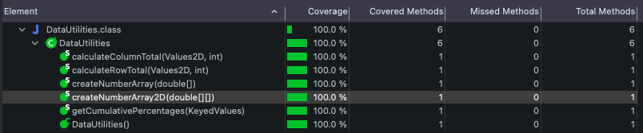

**SENG 438 - Software Testing, Reliability, and Quality**

**Lab. Report #3 – Code Coverage, Adequacy Criteria and Test Case Correlation**

| Group \#:      | 11    |
| -------------- | --- |
| Student Names: | Carter Boucher    |
|                | Ayo Olabode    |
|                | Maheen Hossain   |
|                | Jason Wu    |

# 1 Introduction

Similar to assignment 2 this lab will introduce to the idea of test coverage for unit testing. It is also an introduction to the idea of white box testing. White box testing is important because it allows the tester to have a deeper understanding of the code, it makes for a more thorough testing phase. This is because it tests all possible code paths.

# 2 Manual data-flow coverage calculations for X and Y methods

Text…

# 3 A detailed description of the testing strategy for the new unit test

The plan for both RangeTest.java and DataUtilitiesTest.java was to create test cases that would increase the coverage of the methods. We used EclEmma to determine the coverage of our initial testing methods from assignment 2. With this information we were able to determine which methods needed to be tested more. We then created new test cases that would increase the coverage of the methods. The test cases will be split up and completed similar to assignment 1 and 2.

__Coverage Before__

Range.java (Maheen and Jason)
- Instructions: 44.4%
- Branch: 52.6%
- Method: 52.9%

DataUtilities.java (Carter and Ayo)
- Instructions: 80.2%
- Branch: 73.5%
- Method: 100%

# 4 A high level description of five selected test cases you have designed using coverage information, and how they have increased code coverage

## __RangeTest.java__

## __DataUtilitiesTest.java__

__createNumberArrayOneElement()__

changed to createNumberArrayOneElementPos() and createNumberArrayOneElementNeg()
- Instruction: 13.7% to 23.3%
- Branch: 11% to 19.2%
- Method: 50% to 50%

splitting the create number array test into a positive and negative test was able to incease the coverage of the method. This is important because every possible input must be tested.

__getCumulativePercentagesWithValueNull()__

changed to getCumulativePercentagesWithValueNullFirst(), getCumulativePercentagesWithValueNullSecond(), and getCumulativePercentagesWithValueNullThird()
- Instruction: 33.7% to 100%
- Branch: 45.8% to 100%
- Method: 100% to 100%

Before all three of these tests were in one try loop so only the first test was being run. Splitting the tests into three different methods was able to increase the coverage of the method to 100%.

__getCumulativePercentagesTotalNull()__

changed to getCumulativePercentagesTotalNullFirst(), getCumulativePercentagesTotalNullSecond(), and getCumulativePercentagesTotalNullThird()
- Instruction: 40% to 100%
- Branch: 50% to 100%
- Method: 100% to 100%

Similar to the prior example, when the test method was split to have one test per method the coverage was able to be increased to 100%.

# 5 A detailed report of the coverage achieved of each class and method (a screen shot from the code cover results in green and red color would suffice)

RangeTest.java (Maheen and Jason)

DataUtilitiesTest.java (Ayo and Carter)
- Instructions: 95.2%
- Branch: 88.5%
- Method: 100%

__DataUtilites Instruction Coverage__

__DataUtilites Branch Coverage__

__DataUtilites Method Coverage__

# 6 Pros and Cons of coverage tools used and Metrics you report

The tool that we used to complete this assignment was the EclEmma plugin within eclipse. This is useful because it is built into eclipse and easy to use. With EclEmma we were able to determine the instruction, branch, and method coverage.

A disadvantage of EclEmma was that it didn't provide coverage values for statement or condition coverage. To get around this we used instruction coverage instead of statement coverage, and branch coverage instead of condition coverage.

# 7 A comparison on the advantages and disadvantages of requirements-based test generation and coverage-based test generation.

Creating tests is importent for any project in order to detect any errors in the code. First we look at requirements based testing, this involves creating tests based on the requirements of a project. This is useful because it tests wheter or not the code is working as intended. However, this method is not very effective because it doesn't test the code for all possible inputs, and there may be gaps in the test cases.

Coverage based testing is a method that tests the code based on total coverage. This is useful because you are able to check if the code is working for all possible inputs. The test cases are also more catered to the specific source code. some flaws with coverage based testing is that the tester must understand the code being tested extensively. This can be difficult if the code is complex. Another problem is that critical functions may not be tested extensively enough like in requirements based testing.

# 8 A discussion on how the team work/effort was divided and managed

Similar to assignment 2, Maheen and Jason worked on RangeTest.java and everything that was related to it. Ayo and Carter worked on DataUtilitiesTest.java and everything that was related to it. We all worked together to complete the lab report.

# 9 Any difficulties encountered, challenges overcome, and lessons learned from performing the lab

At first it was difficult to use EclEmma because we didn't know how. With time and practice we were able to understand and use it effectively. We learned how important and useful test coverage can be to a project.

# 10 Comments/feedback on the lab itself

We felt better about this lab than the last one because we had more experience coming into this one.
